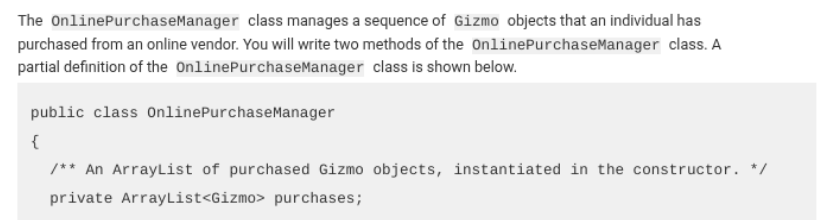

AP CSA Unit 7 FRQ 3

Part (a)
```java
public int countElectronicsByMaker(String maker) {
    int count = 0;
    for (Gizmo purchase : purchases) {
        if (purchase.isElectronic() && maker.equals(purchase.getMaker())) {
            count++;
        }
    }
    return count;
}
```

Part (b)
```java
public boolean hasAdjacentEqualPair() {
    for (int index = 1; index < purchases.size(); index++) {
        if (purchases.get(index - 1).equals(purchases.get(index))) {
            return true;
        }
    }
    return false;
}
```

---

Part (a)
```java {all|2|3,7|3,5,7|2-3,5,7-8}
public int countElectronicsByMaker(String maker) {
    int count = 0;
    for (Gizmo purchase : purchases) {
        if (purchase.isElectronic() && maker.equals(purchase.getMaker())) {
            count++;
        }
    }
    return count;
}
```

This code starts with `count` as `0`.

It has a for-loop to check every element in the ArrayList `purchases` and increase `count`.

Then at the end, after the for-loop is done, it returns `count`.

---

Part (a)
```java {1,4,6|1,4-6|all}
public int countElectronicsByMaker(String maker) {
    int count = 0;
    for (Gizmo purchase : purchases) {
        if (purchase.isElectronic() && maker.equals(purchase.getMaker())) {
            count++;
        }
    }
    return count;
}
```

We only want to increase `count` inside the for-loop for every element that is electronic and made by `maker` (the parameter).

Each element in `purchases` is a `Gizmo` object, which means we can use `isElectronic()` on `purchase`, which returns a boolean (`true` or `false` if it's electronic or not).

The `maker` parameter is a string, which means we can use `equals(...)` on it to compare it to `purchase.getMaker()`, which returns the gizmo's maker as a string.

So our code will count all the gizmos that are electronic and made by `maker`. Thumbs up emoji.

---

Part (a)

So when you start with a blank textbox, you know the goal is to **count** all the electronic gizmos by a specific maker in the `purchases` ArrayList.

That means we need a for-loop and a variable to increase that's declared before the for-loop.

Since we're just checking wheather each element is electronic and checking it's maker, we can use an enhanced for-loop or a regular for-loop.

````md magic-move
```java
public int countElectronicsByMaker(String maker) {

}
```

```java
public int countElectronicsByMaker(String maker) {
    int count = 0;
}
```

```java
public int countElectronicsByMaker(String maker) {
    int count = 0;
    for (Gizmo purchase : purchases) {

    }
}
```

```java
public int countElectronicsByMaker(String maker) {
    int count = 0;
    for (Gizmo purchase : purchases) {
        // each element is `purchase`
    }
}
```

```java
public int countElectronicsByMaker(String maker) {
    int count = 0;
    for (int index = 0; index < purchases.size(); index++) {
        // each element is `purchases.get(index)`
    }
}
```

```java
public int countElectronicsByMaker(String maker) {
    int count = 0;
    for (int index = 0; index < purchases.size(); index++) {
        // each element is `purchases.get(index)`
        // NOT `purchases[index]`
    }
}
```

```java
public int countElectronicsByMaker(String maker) {
    int count = 0;
    for (int index = 0; index < purchases.size(); index++) {
        // each element is `purchases.get(index)`
        // NOT `purchases[index]`
        // Arrays use `array[index]`, ArrayLists use `array.get(index)`
    }
}
```

```java
public int countElectronicsByMaker(String maker) {
    int count = 0;
    for (int index = 0; index < purchases.size(); index++) {
        // each element is `purchases.get(index)`
        // NOT `purchases[index]`
        // Arrays use `array[index]`, ArrayLists use `array.get(index)`
        // `purchases` is an ArrayList (the question told us)
    }
}
```

```java
public int countElectronicsByMaker(String maker) {
    int count = 0;
    for (int index = 0; index < purchases.size(); index++) {
        // each element is `purchases.get(index)`
    }
}
```

```java
public int countElectronicsByMaker(String maker) {
    int count = 0;
    for (Gizmo purchase : purchases) {
        // each element is `purchase`
    }
}
```
````

---

Part (a)

The question tells us that `purchases` is an `ArrayList` with each element inside of it as a `Gizmo` object.



---

Part (a)

Now, we can use `isElectronic()` and `getMaker()` on each element.

So we increase `count` if it's electronic and made by `maker`. We use `equals()` on `maker` because it's a string.

At the end, outside and after the for-loop, we return `count`.

````md magic-move
```java
public int countElectronicsByMaker(String maker) {
    int count = 0;
    for (Gizmo purchase : purchases) {
        // each element is `purchase`
    }
}
```

```java
public int countElectronicsByMaker(String maker) {
    int count = 0;
    for (Gizmo purchase : purchases) {
        // each element is `purchase`
        if (purchase.isElectronic()) {

        }
    }
}
```

```java
public int countElectronicsByMaker(String maker) {
    int count = 0;
    for (Gizmo purchase : purchases) {
        // each element is `purchase`
        if (purchase.isElectronic() && maker.equals(purchase.getMaker())) {

        }
    }
}
```

```java
public int countElectronicsByMaker(String maker) {
    int count = 0;
    for (Gizmo purchase : purchases) {
        // each element is `purchase`
        if (purchase.isElectronic() && maker.equals(purchase.getMaker())) {
            count++;
        }
    }
}
```

```java
public int countElectronicsByMaker(String maker) {
    int count = 0;
    for (Gizmo purchase : purchases) {
        // each element is `purchase`
        if (purchase.isElectronic() && maker.equals(purchase.getMaker())) {
            count++;
        }
    }
    return count;
}
```

```java
public int countElectronicsByMaker(String maker) {
    int count = 0;
    for (Gizmo purchase : purchases) {
        if (purchase.isElectronic() && maker.equals(purchase.getMaker())) {
            count++;
        }
    }
    return count;
}
```
````

---

Part (b)
```java
public boolean hasAdjacentEqualPair() {
    for (int index = 1; index < purchases.size(); index++) {
        if (purchases.get(index - 1).equals(purchases.get(index))) {
            return true;
        }
    }
    return false;
}
```

---

Part (b)
```java {all|1,8|1-2,6,8|1-3,5-6,8}
public boolean hasAdjacentEqualPair() {
    for (int index = 1; index < purchases.size(); index++) {
        if (purchases.get(index - 1).equals(purchases.get(index))) {
            return true;
        }
    }
    return false;
}
```

We use a for-loop that starts at `1` and goes to `purchases.size()`.

We use `size()`, NOT `length` or `length()`, because `purchases` is an ArrayList.

The reason we start at `1` instead of `0` is so we can subtract 1 to get the element before `index`.

We can't use an enhanced for loop because we need the index to be able to compare the previous or next element.

---

Part (b)
```java {1-3,5-6,8|3,5}
public boolean hasAdjacentEqualPair() {
    for (int index = 1; index < purchases.size(); index++) {
        if (purchases.get(index - 1).equals(purchases.get(index))) {
            return true;
        }
    }
    return false;
}
```

We can use the `equals(...)` method on elements of `purchases` because `purchases` is an ArrayList of `Gizmo` objects, and the question told us that the `Gizmo` class has an `equals(...)` method.

Also remember, we're using `get(index)` on `purchases` because it's an ArrayList.

---

Part (b)
```java {3,5|3-5|2-6|2-7|all}
public boolean hasAdjacentEqualPair() {
    for (int index = 1; index < purchases.size(); index++) {
        if (purchases.get(index - 1).equals(purchases.get(index))) {
            return true;
        }
    }
    return false;
}
```

If the equals method is true, then two adjacent elements (two elements next to eachother) are equal, so we return `true`.

Also remember, we're using `get(index)` on `purchases` because it's an ArrayList.

Returning inside the for-loop will exit the loop, which is what we want: when it finds an adjacent equal pair (elements next to eachother that are equal), we don't need to keep searching, so just return `true`.

We have to put the `return false;` **after & outside** the for-loop so that it checks the whole ArrayList before saying there's no adjacent equal pairs.

---

Now we're done with part B. (yay)
```java
public boolean hasAdjacentEqualPair() {
    for (int index = 1; index < purchases.size(); index++) {
        if (purchases.get(index - 1).equals(purchases.get(index))) {
            return true;
        }
    }
    return false;
}
```

---

Part (a)
```java
public int countElectronicsByMaker(String maker) {
    int count = 0;
    for (Gizmo purchase : purchases) {
        if (purchase.isElectronic() && maker.equals(purchase.getMaker())) {
            count++;
        }
    }
    return count;
}
```

Part (b)
```java
public boolean hasAdjacentEqualPair() {
    for (int index = 1; index < purchases.size(); index++) {
        if (purchases.get(index - 1).equals(purchases.get(index))) {
            return true;
        }
    }
    return false;
}
```
